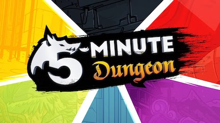

```{r setup, include=FALSE}
knitr::opts_chunk$set(echo = TRUE)
```
<br>
 


### Five Minute Dungeon Experiments  
A set of code, experimentation, and data to explore the power of teams, design thinking, and statistics in R.  

The purpose is to explore data over time, reproducibility in science, and replication. So many fun questions pop from replaying this game even a few times in a row with an experimental mindset.  

#### Data  
Weekly experiments and data collected by teams.  

```{r, data, warning=FALSE, message=FALSE}
#install.packages("tidyverse") #only need to do this once then mute it with #
library(tidyverse)
data <- read_csv(url("https://ndownloader.figshare.com/files/17591273")) #read from web for updates
#data <- read_csv("data/5MD.csv")

#transform data and tidy
#rename time to remaining so it is more clear
data <- data %>%
  rename(time_remaining = time)


#BIOL3250 suggestion to test number of cards in play
#2 players = 5 each from rules so total = 10
#3 players = 4 each so 12
#4 players = 3 each and 5 and 6 players same - 3 each
#we only player to 5 but 6 might be allowed?

data <- data %>%
  mutate(time_to_complete = 300 - time_remaining) %>%
  mutate(total_cards = case_when(players == 2 ~ 10, players == 3 ~ 12, players == 4 ~ 12, players == 5 ~ 15, players == 6 ~ 18))

```

#### Viz  
```{r, viz, warning=FALSE, message=FALSE}
#explore distribution in main measure
ggplot(data, aes(time_remaining, fill = class)) +
  geom_histogram(binwidth = 40) +
  scale_fill_brewer(palette = "Set1")

#explore continuous variation
ggplot(data, aes(players, time_remaining)) +
  geom_point(size = 2, aes(color = class)) +
  xlim(c(2,5)) +
  geom_smooth(method = lm) +
  scale_color_brewer(palette = "Set1")

ggplot(data, aes(total_cards, time_remaining)) +
  geom_point(size = 2,  aes(color = class)) +
   geom_smooth(method = lm) +
  scale_color_brewer(palette = "Set1")

ggplot(data, aes(time_remaining, joy)) +
  geom_point(size = 2,  aes(color = class)) +
   geom_smooth(method = lm) +
  scale_color_brewer(palette = "Set1")

#explore groups
ggplot(data, aes(class, time_remaining)) +
  geom_boxplot()

```

#### Models
```{r, models, warning=FALSE, message=FALSE}
#test of whether net difference in gaming is a win across both classes
t.test(data$time_remaining, mu = 0)

```

#### Interpretations  
1. Larger teams are not necessarily more effective.  
2. Time and joy not related but might be better to test won-lost as response.  
